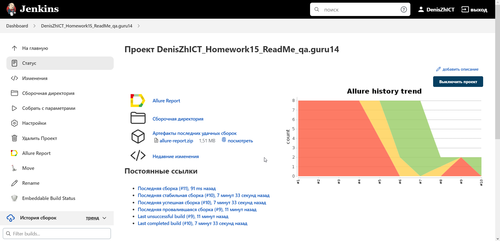
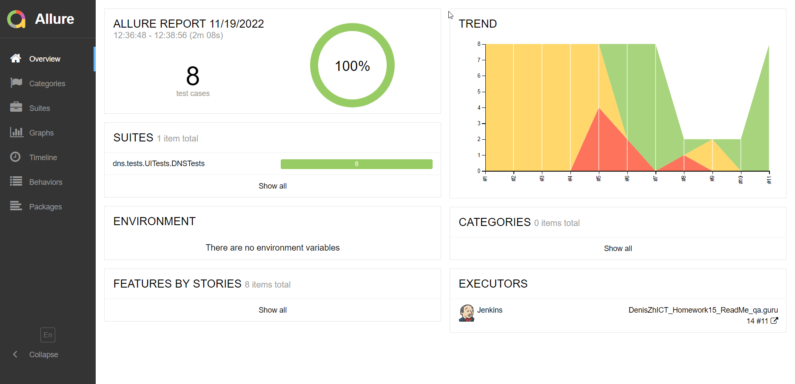
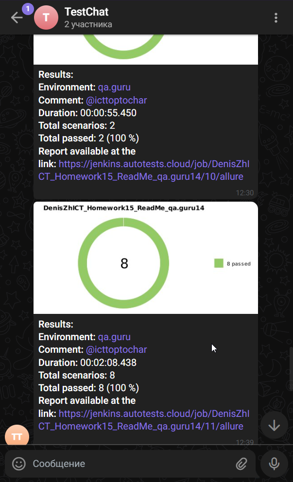

# Проект по автоматизации тестирования DNC

## :scroll: Содержание:

- [Технологии и инструменты](#-технологии-и-инструменты)
- [Реализованные проверки](#-реализованные-проверки)
- [Сборка в Jenkins](#-jenkins-job)
- [Запуск из терминала](#-Запуск-тестов-из-терминала)
- [Allure отчет](#-отчет-в-allure-report)
- [Отчет в Telegram](#-уведомление-в-telegram-при-помощи-бота)
- [Видео примеры прохождения тестов](#-примеры-видео-о-прохождении-тестов)

## :hammer_and_wrench: Технологии и инструменты

<p align="center">
<a href="https://www.jetbrains.com/idea/"></a>
<a href="https://www.java.com/"></a>
<a href="https://github.com/"></a>
<a href="https://junit.org/junit5/"></a>
<a href="https://gradle.org/"></a>
<a href="https://selenide.org/"></a>
<a href="https://aerokube.com/selenoid/"></a>
<a href="https://github.com/allure-framework/allure2"></a>
<a href="https://www.jenkins.io/"></a>
</p>

## :memo: Реализованные-проверки

- :white_check_mark: Проверка смены города.
- :white_check_mark: Проверка поисковой системы.
- :white_check_mark: Проверка системы каталога.
- :white_check_mark: Проверка добавления продукта в корзину.
- :white_check_mark: Проверка добавления продукта в список желаемого.
- :white_check_mark: Проверка удалеиня продукта из корзину.
- :white_check_mark: Проверка удаления продукта из список желаемого.
- :white_check_mark: Проверка открытия сайта помощи.

## :man_technologist: Jenkins job

<a target="_blank" href="https://jenkins.autotests.cloud/job/DenisZhICT_Homework15_ReadMe_qa.guru14/">Сборка в Jenkins</a>
<p align="center">

</p>

### Параметры сборки в Jenkins:

* environment (Определят запуск локальный или удалённый)
* test_type (Определят тип запускаемых тестов по Tag'ам)

### :desktop_computer: Запуск тестов из терминала

```bash
gradle clean All
```

### :globe_with_meridians: Удаленный запуск:

```bash
clean 
${TEST_TYPE} 
-Denvironment=${ENVIRONMENT}
```

## :bar_chart: Отчет в <a target="_blank" href="https://jenkins.autotests.cloud/job/DenisZhICT_Homework15_ReadMe_qa.guru14/11/allure/">Allure report</a>

### Основное окно

<p align="center">

</p>


## :grapes: Уведомление в Telegram при помощи бота

<p align="center">

</p>

### :film_strip: Пример видео о прохождении тестов

<p align="center">

</p>